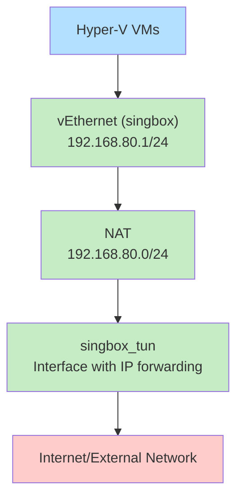

# singbox-hyper-v-net-config
Configure the Hyper-V VM switch to connect through the Singbox tunnel NIC

## Overview
This repository contains PowerShell scripts that set up a Hyper-V virtual switch configuration to route VM traffic through the Sing-Box tunnel interface. This allows VMs to automatically use the Sing-Box proxy/VPN connection.

## Script Logic
The `set-up-vswitch.ps1` script performs the following operations:

1. Creates an internal Hyper-V switch named "singbox"
2. Enables IP forwarding on the "singbox_tun" interface (the Sing-Box tunnel adapter)
3. Enables IP forwarding on the "vEthernet (singbox)" interface (the Hyper-V virtual switch)
4. Assigns the IP address 192.168.80.1/24 to the virtual switch
5. Creates a NAT configuration named "SingboxNAT" for the 192.168.80.0/24 subnet
6. Adds a route to direct all traffic (0.0.0.0/0) through the singbox_tun interface

## Network Architecture



## Usage
1. Ensure Sing-Box is properly configured and the "singbox_tun" interface exists
2. Run the script with administrative privileges:
   ```powershell
   powershell -ExecutionPolicy Bypass -File set-up-vswitch.ps1
   ```
3. Connect your Hyper-V VMs to the "singbox" virtual switch
4. Configure your VMs to use DHCP or assign static IPs in the 192.168.80.0/24 range

## Requirements
- Windows 10/11 or Windows Server with Hyper-V enabled
- Administrative privileges
- Sing-Box properly configured with TUN mode enabled
